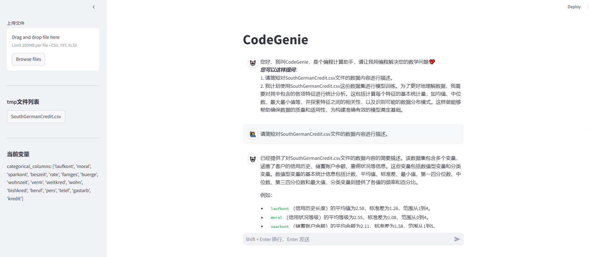

# 🤗 CodeGenie - 智能编程助手


数据处理和分析对于数据分析工作人员来说，往往既复杂又令人头疼，需要耗费大量精力进行重复性工作。为了解决这一问题，我们开发了一款集成了自然语言处理和代码生成功能的智能编程助手——CodeGenie。通过对话形式，CodeGenie能够智能地分析数据和管理文件。无论您是经验丰富的开发人员还是编程新手，CodeGenie都能成为您的得力助手。

## 项目简介
CodeGenie 是一款旨在通过对话形式简化编程工作的工具。它不仅可以帮助用户生成并执行Python代码，还能进行文件管理、数据分析，并提供实时反馈。这款助手特别适合需要频繁处理数据的场景，如数据分析、金融建模和机器学习等。需要强调的是，CodeGenie 基于 SmolAgents 代理框架，其核心功能是通过编写代码来执行数据分析任务，而不是简单地使用代理来编写代码。这意味着 CodeGenie 能够自主编写和执行代码以完成复杂的分析工作，而不是仅仅作为一个辅助工具。

[功能特性](#功能特性) | [使用指南](#使用指南) | [使用配置](#使用配置) | [立即体验](#快速开始) 

## 功能特性 

### 核心能力
- **自然语言编程**：通过对话形式完成代码生成与执行
- **文件管理系统**：
  - csv/xlsx/txt文件上传至代默认目录（默认操作目录为`tmp`）
  - 实时文件列表展示与下载
- **变量管理**：
  - 实时显示常用类型变量
  - 交互式变量追踪面板
- **智能工具集成**：
  - 内置Tavily搜索引擎（知识增强）

### 技术亮点
- 基于大语言模型
- 模块化工具架构设计
- 交互式错误处理机制

## 使用指南📖
### 1.上传文件
-   通过侧边栏上传数据文件到tmp目录
-   支持格式：csv/txt/xlsx

### 2.提出问题
```示例
1. 请计算1+9=?
2. 请对SouthGermanCredit.csv文件的数据内容进行特征统计分析。
```
### 3.查看结果
-  实时代码执行反馈
-  生成文件自动保存至tmp
-  变量状态实时更新
### 4.演示
- 打开网址：http://localhost:8501/#codegenie
- 应用界面


- [魔塔演示地址](https://modelscope.cn/studios/nqzxm0618/codegenie/summary)
## 使用配置
### 环境变量

```env
# 在.env文件中配置

# Tavily搜索服务，可选。
TAVILY_KEY=xxx

# 设置模型信息
MODEL_ID=xxx # 模型的名称id
API_KEY =xxx  # 模型的Key
BASE_URL=xxx # 模型的访问地址

```

python包导入编程环境
```python
authorized_imports = [
    'pandas', 'numpy', 'matplotlib',
    'seaborn', 'os', 're', 'datetime'
]
```

## 快速开始🚀

### 环境要求
- Python 3.8+
- pip 23.0+

### 安装步骤
```bash
# 克隆仓库
git clone https://github.com/jinhongzou/codegenie.git
cd codegenie

# 安装依赖
pip install -r requirements.txt

# 设置TAVILY的API密钥（可选）
export TAVILY_KEY='your_tavily_key'
# 设置模型信息
export MODEL_ID='your_llm_model_id'
export API_KEY='your_llm_key'
export BASE_URL='your_llm_url'

```

### 启动应用 
```bash
streamlit run app.py
```

---
## 贡献指南 🤝
欢迎通过以下方式参与项目：
1. 提交Issue报告问题
2. Fork仓库并提交Pull Request
3. 完善文档与测试用例

## 许可证 📄
CodeGenie is completely free and open-source and licensed under the [Apache 2.0](https://www.apache.org/licenses/LICENSE-2.0) license.

## 致谢 🙏
-    智能体框架 [smolagents](https://github.com/huggingface/smolagents)

-    交互式应用框架 [Streamlit](https://github.com/streamlit/streamlit)

