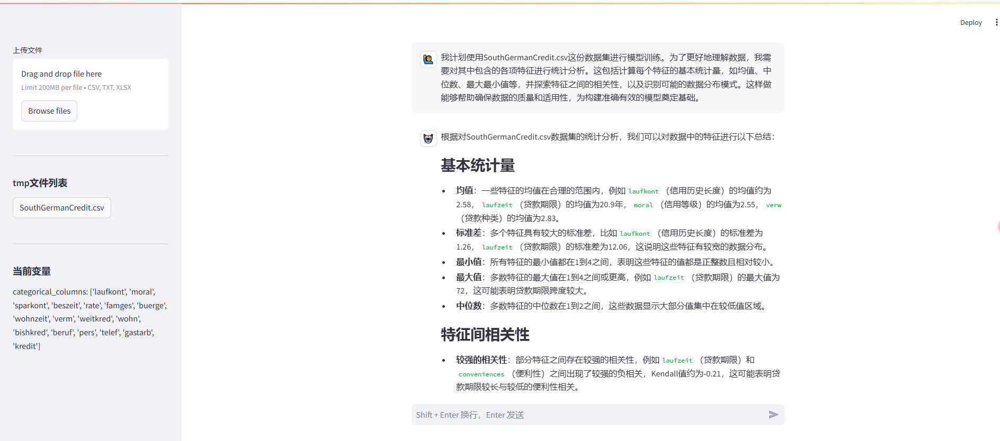
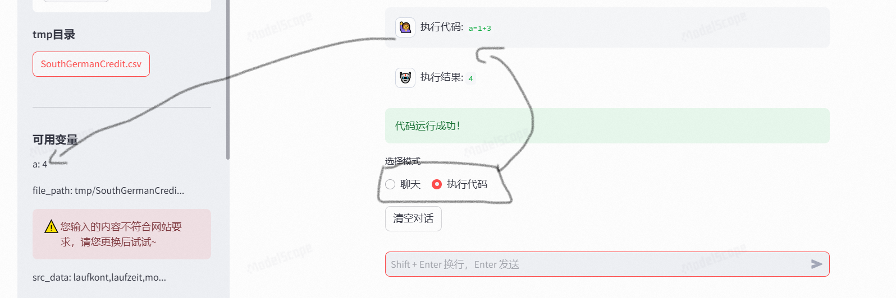

# 🤗 CodeGenie - 协作编程智能助手


当前市场上存在许多LLM（大语言模型）编程助手，但它们大多依赖用户通过指令来引导LLM进行编程，这种方式存在多个痛点：**1) LLM对具体业务的不熟悉**，导致生成的代码质量不高；**2) LLM的智能程度有限**，有时编写的代码无法直接使用；**3) 用户的指令或提示词过长**，LLM可能难以准确理解意图；**4)** 在代码执行过程中产生的结果，**用户没有干预手段**。针对这些问题，CodeGenie应运而生。不同于传统的大语言模型编程助手，CodeGenie强调的是协作而非单纯的辅助。这意味着用户不仅仅是依赖大语言模型来完成编程任务，还可以与CodeGenie共同参与编程过程。

CodeGenie基于SmolAgents大型语言智能体框架构建，并采用Streamlit作为其交互式的应用界面。该助手不仅集成了先进的自然语言处理技术与强大的代码生成功能，还特别优化了与用户交互的过程，以便更好地理解需求和上下文。无论是数据处理、文件操作，还是其他复杂的编程任务，用户都可以通过与CodeGenie的自然对话轻松完成。CodeGenie旨在简化您的编程流程，通过自然语言交流来提高编程效率和工作满意度。这款工具是为那些希望通过更直观、更高效的方式利用代码解决问题的人设计的，让编程变得更加简单易行。

[功能特性](#功能特性) | [使用指南](#使用指南) | [使用配置](#使用配置) | [立即体验](#快速开始) 

## 功能特性 

### 核心能力
- **自然语言编程**：借助大模型的能力，通过对话形式让大模型完成特定任务的代码生成，并执行。

- **可视化**：用户与大语言模型共享文件及编程过程产生的变量
  - 文件管理：
    - csv/xlsx/txt文件上传至代默认目录（默认操作目录为`tmp`）
    - 实时文件列表展示与下载
  - 变量管理：
    - 实时显示常用类型变量
    - 交互式变量追踪面板

- **交互式执行代码**：
  - 根据llm生成的变量，执行用户自己代码

- **智能工具集成**：
  - 内置Tavily搜索引擎（知识增强）

### 技术亮点
- 基于大语言模型
- 模块化工具架构设计
- 交互式错误处理机制

## 使用指南📖
### 1.上传文件
-   通过侧边栏上传数据文件到tmp目录
-   支持格式：csv/txt/xlsx

### 2.提出问题
- 1）聊天模式
```
1. 请计算1+9=?
2. 请对SouthGermanCredit.csv文件的数据内容进行特征统计分析。
```
- 2）执行代码模式
```
a=1+9
```
### 3.查看结果
-  实时代码执行反馈
-  生成文件自动保存至tmp
-  变量状态实时更新
### 4.演示
- 打开网址：http://localhost:8501/#codegenie
- 应用界面

<video width="640" height="360" controls>
  <source src="https://www.toutiao.com/video/7485300506361872932/?from_scene=all&log_from=671563184e37d_1742810149971" type="video/mp4">
</video>

**共享文件**


**可视化变量**


**交互式执行代码**


- [魔塔演示地址](https://modelscope.cn/studios/nqzxm0618/codegenie/summary)
## 使用配置
### 环境变量

```env
# 在.env文件中配置

# Tavily搜索服务，可选。
TAVILY_KEY=xxx

# 设置模型信息
MODEL_ID=xxx # 模型的名称id
API_KEY =xxx  # 模型的Key
BASE_URL=xxx # 模型的访问地址

```

python包导入编程环境
```python
authorized_imports = [
    'pandas', 'numpy', 'matplotlib',
    'seaborn', 'os', 're', 'datetime'
]
```

## 快速开始🚀

### 环境要求
- Python 3.8+
- pip 23.0+

### 安装步骤
```bash
# 克隆仓库
git clone https://github.com/jinhongzou/codegenie.git
cd codegenie

# 安装依赖
pip install -r requirements.txt

# 设置TAVILY的API密钥（可选）
export TAVILY_KEY='your_tavily_key'
# 设置模型信息
export MODEL_ID='your_llm_model_id'
export API_KEY='your_llm_key'
export BASE_URL='your_llm_url'

```

### 启动应用 
```bash
streamlit run app.py
```

---
## 贡献指南 🤝
欢迎通过以下方式参与项目：
1. 提交Issue报告问题
2. Fork仓库并提交Pull Request
3. 完善文档与测试用例

## 许可证 📄
CodeGenie is completely free and open-source and licensed under the [Apache 2.0](https://www.apache.org/licenses/LICENSE-2.0) license.

## 致谢 🙏
-    智能体框架 [smolagents](https://github.com/huggingface/smolagents)

-    交互式应用框架 [Streamlit](https://github.com/streamlit/streamlit)

<!--  -->